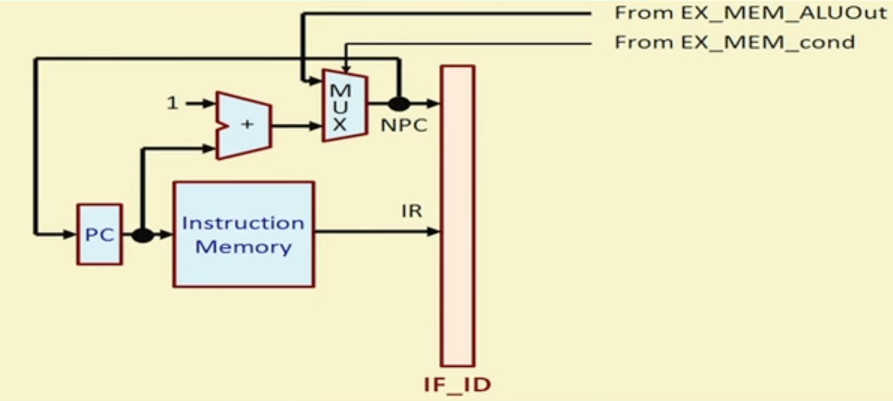

# INSTRUCTION CYCLE
## structure of latches-
- between every statge of the cycle, we will have a latch labled stage1_stage2  
for example, EX_MEM
- each latch will be one clock cycle ahead of the latch in front of it 
- every latch will have temporary registers stored in it 
for example, EX_MEM_IR: instruction reg stored in EX_MEM latch
## 1) IF: instrction fetch  
IF_ID_IR <- Mem[PC]; 
if (EX_MEM_IR[opcode]==branch & EX_MEM_cond) <t>
IF_ID_NPC, PC <- EX_MEM_ALUOut 
else <t>
IF_ID_NPC = PC + 1;

## 2)ID: instrction decode, register fetch 
A <- Reg[IR[25:21]] 
B <- Reg[IR[20:16]] 
Imm <- sign extended IR[15:0] (extend the value to 32 bits by replicating the MSB and placing it on the left) 
## 3)EX: execution/address calc
- ALUOut <- A + Imm //LW R3, 100(A)  
- ALUOut <- A func B //SUB R2, A, B 
- ALUOut <- A func Imm //SUBI R2, A, Imm 
- ALUOut <- NPC + Imm // BEQZ R2, Label 
cond <- A op 0 //== or !=
## 4) MEM: memory access/branch completion
- Load:  
PC <- NPC; 
LMD <- Mem[ALUOut];
- Store:  
PC <- NPC; 
Mem[ALUOut] <- B;
- branch 
if (cond) PC <- ALUOut 
else <t> Pc <- NPC
- other instructions 
Pc <- NPC
## 5) WB: writeback
- reg-reg instruction 
Reg[IR[15:11]] <- ALUOut
- reg-imm instruction  
Reg[IR[20:16]] <- ALUOut
- load instr 
Reg[IR[20:16]] <- LMD
